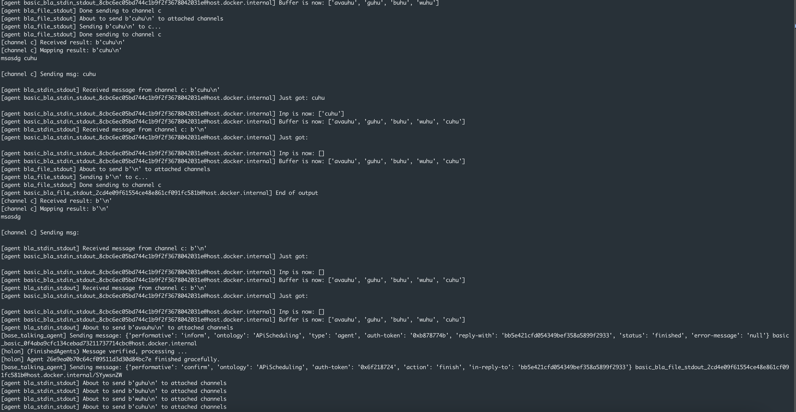

# Awkward π-nguin (APi)

APi is a multi-agent system orchestration platform comprised of a newly developed programming language to specify communication flows (agents' orchestration) in a specification file, an orchestration platform that consumes the specification and accordingly starts up the agents, and agent definitions that describe the communication channel and protocol for every individual agent, allowing seamless communication with the orchestration platform.

## Ecosystem

The key entities in the APi ecosystem are:

- Agent
  - A independent service that can be implemented in any technology stack.
  - Each agent must use one of the supported communication protocols:
    - Netcat
    - WebSocket
    - HTTP
    - File-based communication (FILE)
- Channel
  - A core APi resource that facilitates communication between agents.
  - Agents do not communicate directly with one another; instead, they interact via channels.
  - One or more agents can write to a channel, listen to a channel, or both.
  - Channels may include lightweight transformation logic—reading incoming data and converting it into a different format before output.
  - Channel communication is restricted to TCP and UDP protocols.
- Holon
  - A holon represents a cluster of agents and channels that communicate internally.
  - Holons allow for compositional hierarchy, enabling complex systems to be built from simpler subsystems.
- Environment
  - An environment is a communication channel between holons.
  - Each holon may have an input environment and an output environment:
    - The input environment collects messages sent from other holons and makes them available to the holon’s internal agents and channels.
    - The output environment collects messages generated within the holon (by agents and channels) and sends them to other holons subscribed to it.
  - Like channels, environments can also apply lightweight transformation logic to modify messages between input and output.
  - Environment communication is also limited to TCP and UDP protocols.
- Execution Flow
  - Defines the startup order of agents within the system.
  - Agents can be started:
    - Sequentially
    - In parallel
    - Based on conditional logic, such as starting only if a previous agent succeeds or fails.

## Components

Following are high level components of APi:

### 1. Agent Orchestration Specification

Written in the **APi programming language** (using `.api` files) that specifies communication flows between agents and other entities.

Example:

```
import holon_2

environment .

channel c .

agent a:
  ENV_INPUT -> self
  self -> c

agent b:
  c -> self
  self -> ENV_OUTPUT

start a | b
```

### 2. Orchestration Platform

The orchestration platform that consumes `.api` specs and:

- Spawns:
  - Holons
  - Environments
  - Channels
  - Agent Wrappers (responsible for lifecycle, protocol handling)
- Manages execution flow based on lifecycle events.
- Bridges agents using protocol adapters.
- Ensures full lifecycle visibility and control.

### 3. Agent Definition

Each agent has a `.ad` YAML file describing its communication protocol, so that the orchestration can interact with it. Additionally, the agent definition defines how the agent should be started whether it is a UNIX process, Docker container, or Kubernetes pod.

Structure:

- `name`, `description`, `start`, `type` (UNIX, Docker, Kubernetes)
- `input` / `output`:
  - `type`: `WS`, `HTTP`, `FILE`, `NETCAT`, `STDIN`
  - `data-type`: `STREAM` or `ONEVALUE`
  - `fmt`, `cutoff`, `end`, `value-type`

Example (HTTP-based agent):

```
agent:
  name: http_onevalue_agent
  description: >
    Receives a single value via HTTP.
  type: unix
  start: python3 -m http_server
  input:
    type: HTTP http://localhost:5000/input
    data-type: ONEVALUE
    value-type: STRING
  output:
    type: HTTP http://localhost:5000/output
    data-type: ONEVALUE
    value-type: STRING
```

## Pros and Cons

### Pros

- Central source of truth for communication flows.
- Protocol-agnostic and adapter-based design.
- Minimal code change for agent integration.
- Lightweight and formal programming language.
- Scalable, hierarchical (holonic) architecture.
- Supports modern deployment environments.

### Cons

- Requires learning a new language.
- Cannot orchestrate already-running agents.
- Lacks built-in security/authentication.
- Race conditions in some coordination flows.
- No GUI for orchestration visualization.
- Agents must be predefined, not dynamically registered.

# Code structure

Below is a high level overview of the code structure of APi.

```
api/
├── src/ # Source code of the APi platform
│ ├── main.py # Entrypoint of the APi platform
│ ├── agents/ # Logic for agents' orchestration
│ ├── config/ # Settings of the APi platform
│ ├── grammar/ # Programming language grammar setup
│ ├── models/ # Common models used across the project
│ ├── orchestration/ # Setup for the orchestration platform
│ ├── utils/ # Utility functions
├── examples/ # Example artifacts to run the platform such as agents' orchestration specifications, agent definitions, agent implementation, etc.
│ ├── agent_definitions/ # Agent definitions
│ ├── docker/ # Dockerized agent example
│ ├── agents/ # Agents implementation
│ ├── inputs/ # Sample inputs for the agents
│ ├── orchestration_specifications/ # Sample orchestration specifications
│ ├── mas_configuration/ # Configuration for the MAS
├── scripts/ # Scripts to help with the development process
├── install.sh # Script to install the APi platform Python dependencies
├── docker-compose.yaml # Docker compose file to start up the APi platform services
├── Dockerfile # Dockerfile to build the APi platform Python Docker image
├── .env.sample # Sample environment variables file
├── pyproject.toml # Python dependencies
├── data/ # Data files for Prosody server
├── public/ # Files for documentation
```

# Local setup

In the current form, APi is meant to be run as a Dockerized container which is preconfigured with the correct dependencies as well as the access to Prosody XMPP server.

Running Dockerized containers provides full support to running services locally. The docker compose starts up:

- prosody server -- which enables XMPP communication (takes away the hurdle of registering accounts)
- python3 environment -- which comes with installed prerequisites required to run the application

The dockerized containers are meant to be used for the development phase, hence the python3 environment reads files current directory and supports hot reload, so that any changes made to the files may immediately be executed from the environment.

Run the following steps to start up the dockerized environment:

1. `docker-compose up -d` -- which shall download & build the containers
2. `docker exec -ti api /bin/bash` -- to bash into the python3 environment
3. Create a copy of `.env.sample`, name it `.env` and adjust values accordingly
4. From inside the bash shell: `poetry run python3 src/main.py basic.api` -- in order to run the application with the communication flows specification file
5. To view live prosody logs, which might be helpful as they preview connections, run: `docker logs -f --tail 10 prosody`

Once correctly started, you should see an output such as below:



## Running Dockererized agents inside the Platform container

APi allows for running agents as Docker containers among other types (Unix & Kubernetes). This is achieved by having the root service (APi service) having Docker installed inside (DinD). Additionally, the Docker socket is passed as volume to the root service, which essentially means that the container has access to Docker on the host machine. That means that if the dockerized APi containers starts up new Docker container, these new containers will be treated as siblings to the APi container.

Within this setup, there is an example on how to run APi that starts up dockerized agent. Below are steps needed to be able to run the agent.

1. Positionate to `examples/docker` directory which will be used to build a new image that will contain a file to be read
2. Run `docker build -t api_docker_example .` which will build the image
3. Create a copy of `.env.sample`, name it `.env` and adjust values accordingly
4. Run APi as with unix approach `poetry run python3 src/main.py docker.api` -- it is a specificaiton that uses the dockerized agent

Similarily, you can create your own docker container, which communicates via STDINT / STDOUT and use it.

# Formatting

Run below command to check formatting and fix issues.

`poetry run ruff check src --fix`

# Notes

This work has been supported in full by the Croatian Science Foundation under the project number [IP-2019-04-5824](http://dragon.foi.hr:8888/ohai4games).
